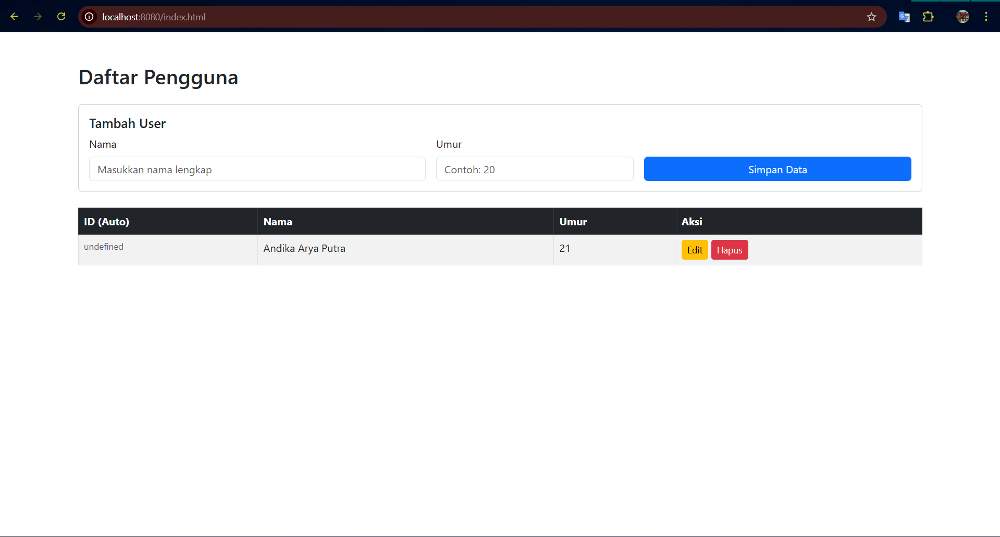

# 📌 User API Documentation

REST API sederhana untuk mengelola data user.

---
Tampilan WEB:


## 🔗 Base URL

```
http://localhost:8080/api/users
```

---

# 📦 Endpoints

---

## 1️⃣ Create User

**Endpoint**

```
POST /api/users
```

**Request Body**

```json
{
  "name": "Andika Arya",
  "age": 21
}
```

**Response (201 Created)**

```json
{
    "data": {
        "Id": "162d8b82-aad0-4985-8dfe-283d36254fef",
        "age": 20,
        "name": "Andika Arya Putra"
    },
    "status": "success"
}
```

---

## 2️⃣ Update User

**Endpoint**

```
PUT /api/users/{id}
```

**Path Parameter**

| Parameter | Type | Description |
|-----------|------|------------|
| id | UUID | ID user yang akan diupdate |

**Request Body**

```json
{
  "name": "Andika Arya Putra",
  "age": 19
}
```

**Response (200 OK)**

```json
{
    "data": {
        "Id": "162d8b82-aad0-4985-8dfe-283d36254fef",
        "age": 19,
        "name": "Andika Arya Putra"
    },
    "status": "success"
}
```

---

## 3️⃣ Get All Users

**Endpoint**

```
GET /api/users
```

**Response (200 OK)**

```json
{
    "data": [
        {
            "Id": "147df337-e956-4ef2-98a2-45985f8c5720",
            "age": 21,
            "name": "Andika Arya Putra"
        },
        {
            "Id": "162d8b82-aad0-4985-8dfe-283d36254fef",
            "age": 19,
            "name": "Andika Arya Putra"
        }
    ],
    "status": "success"
}
```

---

## 4️⃣ Get User By ID

**Endpoint**

```
GET /api/users/{id}
```

**Response (200 OK)**

```json
{
    "data": {
        "Id": "147df337-e956-4ef2-98a2-45985f8c5720",
        "age": 21,
        "name": "Andika Arya Putra"
    },
    "status": "success"
}
```

---

## 5️⃣ Delete User

**Endpoint**

```
DELETE /api/users/{id}
```

**Response (200 OK)**

```json
{
    "status": "success delete user with id 147df337-e956-4ef2-98a2-45985f8c5720"
}
```

---

# ❗ Standard Error Response

## 400 Bad Request

```json
{
  "status": "error",
  "message": "Invalid request body"
}
```

## 404 Not Found

```json
{
  "status": "error",
  "message": "User not found"
}
```

## 500 Internal Server Error

```json
{
  "status": "error",
  "message": "Internal server error"
}
```

---

# 📘 Data Model

| Field | Type | Description |
|-------|------|------------|
| Id | UUID | Unique identifier |
| name | String | Nama user |
| age | Integer | Umur user |

---

# 🚀 How to Run

1. Clone repository
2. Run the application
3. Server berjalan di port `8080`
4. Test menggunakan Postman atau curl

---

# 🧪 Example curl

## Create User

```bash
curl -X POST http://localhost:8080/api/users \
-H "Content-Type: application/json" \
-d '{"name":"Andika Arya Putra","age":21}'
```

## Get All Users

```bash
curl http://localhost:8080/api/users
```

## Update User

```bash
curl -X PUT http://localhost:8080/api/users/{id} \
-H "Content-Type: application/json" \
-d '{"name":"Andika Arya Putra","age":19}'
```

## Delete User

```bash
curl -X DELETE http://localhost:8080/api/users/{id}
```